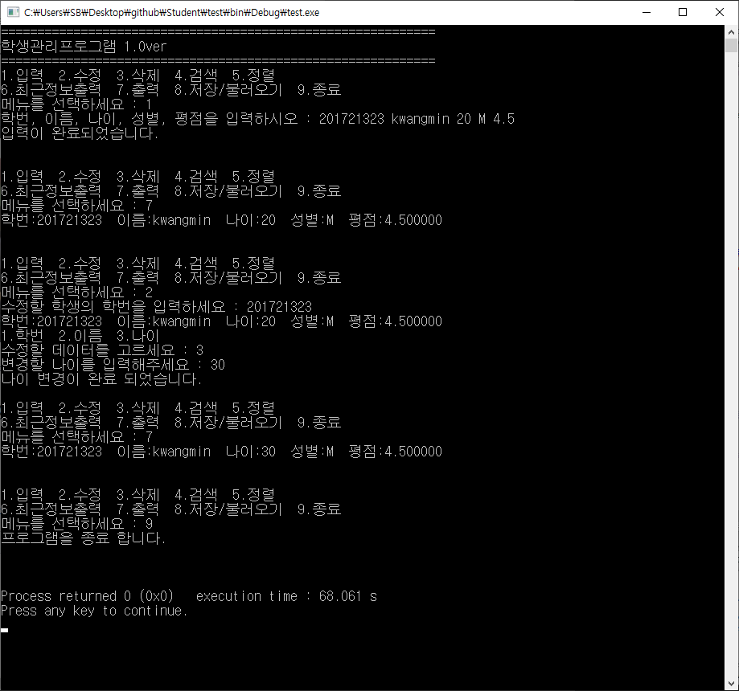

# Student
#### A student information management system in C  

### Description  
This program is a simple management system for student information. 
The information consists of studnet id, name, age, gender, and GPA. 
The data can be added, modified, and deleted. 
You can also search students' info, and display, save, load them. 
  
### Usage  
As the instruction shows, insert command #:  
- #1 : Insert info  
- #2 : Modify info  
- #3 : Delete info  
- #4 : Search  
- #5 : Display info in order  
- #6 : Display the last student info  
- #7 : Display all  
- #8 : Save or Load data  
- #9 : Terminate  
  
  
&nbsp;  
### FYI  
This program is coded when I was first grade in college. Please don't care of the file name (LinkedListType.c?) 
and use Bubble Sorting;)
